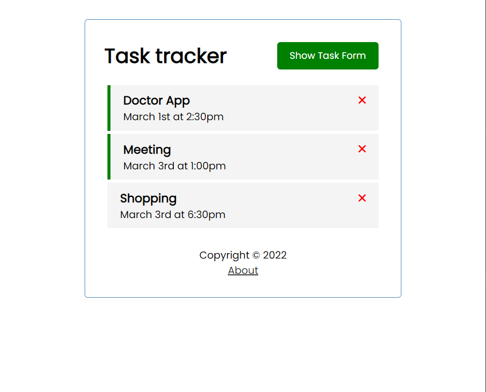

# VueJS Task Tracker

Simple example of a VueJS(v3) application.

Source: https://www.youtube.com/watch?v=qZXt1Aom3Cs

## Project setup
```
npm install
```

### Compiles and hot-reloads for development
```
npm run serve
```

### Runs json-server as a temporary backend database
```
npm run json-backend
```

### Compiles and minifies for production
```
npm run build
```

